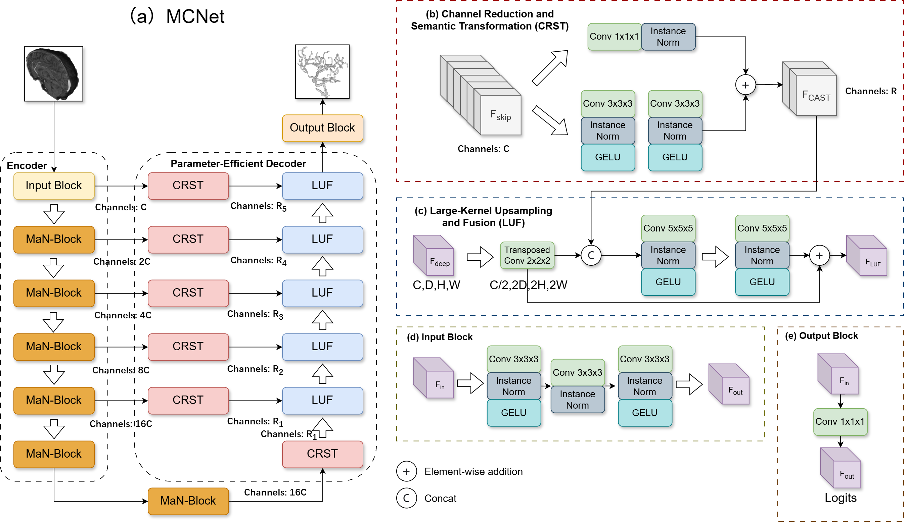

# MCNet: Efficient Cerebrovascular Segmentation via Parallel CNN-Mamba Architecture

[](https://opensource.org/licenses/MIT)
[](https://pytorch.org/)

> **NOTICE:** This is the official implementation of the manuscript **"Efficient Cerebrovascular Segmentation via Parallel CNN-Mamba Architecture"**, which is currently **under revision** for publication in *The Visual Computer*. (This repository currently contains only the core model architecture. The complete codebase will be released upon the paper's acceptance.)

## 📖 Introduction

Accurate segmentation of cerebrovascular structures from 3D Magnetic Resonance Angiography (MRA) is crucial for Computer-Aided Diagnosis (CAD). In this work, we propose **MCNet**, a compact hybrid architecture that integrates:

* **CNNs** for local feature extraction.
* **Mamba (SSM)** for linear-complexity global modeling.
* A novel **Parallel CNN-Mamba Encoder** design.

Our method achieves superior performance on the **COSTA benchmark** (Dice: 92.35%, clDice: 92.08%) while reducing FLOPs by over 50% compared to state-of-the-art methods.



## 🛠️ Requirements

The code is implemented using Python 3.10+ and PyTorch 2.6.0+.

1. **Clone the repository:**

   ```bash
   git clone https://github.com/iMED-Lab/COSTA.git
   ```

2. **Install dependencies:**
   Since `mamba-ssm` requires specific CUDA setup, we recommend using the following steps:

   ```bash
   # Create a virtual environment
   conda create -n mcnet python=3.10
   conda activate mcnet
   
   # Install PyTorch (Adjust cuda version based on your GPU)
   pip install --no-cache-dir \ 
     torch==2.6.0 torchvision==0.21.0 torchaudio==2.6.0 --index-url https://download.pytorch.org/whl/cu118
     
   # Install Mamba and Causal Conv1d from https://github.com/state-spaces/mamba
   # Note that we use causal_conv1d-1.5.2+cu11torch2.6cxx11abiFALSE-cp310-cp310-linux_x86_64.whl 
   # and mamba_ssm-2.2.5+cu11torch2.6cxx11abiFALSE-cp310-cp310-linux_x86_64.whl
   
   # Install other requirements
   pip install --no-cache-dir \
     monai \
    'monai[nibabel,tqdm,matplotlib,tensorboard,skimage]' \
     hydra-core --upgrade \
     scikit-learn \
     torchio \
     lightning \
     wandb
   ```

## 📂 Dataset Preparation

We utilized the **COSTA** dataset [iMED-Lab/COSTA: COSTA: A Multi-center Multi-vendor TOF-MRA Dataset and A Novel Cerebrovascular Segmentation Network](https://github.com/iMED-Lab/COSTA) and preprocessed the MRA data based on their work.
